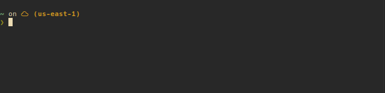

# Tufa

A simple 2-factor authentication generator.

Left to do:
- [✓] Encrypt secrets with master password
- [✓] Actual error handling
- [✓] Confirmation prompting
- [✓] `tufa ls`
- [✓] rename to `tufa rm`
- ~~Clipboard integration~~ _(Just pipe into xclip)_
